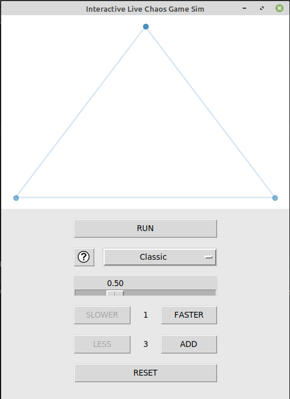

# IChaos-Game

A python implementation of a fractal-creating method called [Chaos Game](https://en.wikipedia.org/wiki/Chaos_game). 
It simulates the algorithm live using matplotlib. Interactive controls are provided by a GUI written in tkinter.

#### About Chaos Game

In mathematics, the term chaos game originally referred to a method of creating a fractal, using a polygon and an initial point selected at random inside it. The fractal is created by iteratively creating a sequence of points, starting with the initial random point, in which each point in the sequence is a given fraction of the distance between the previous point and one of the vertices of the polygon; the vertex is chosen at random in each iteration.

## Installation

Make sure you have [Python 3](https://www.python.org/downloads/) installed,

If you haven't already, install [pillow](https://pypi.org/project/Pillow/) and [matplotlib](https://pypi.org/project/matplotlib/)
```bash
python -m pip install pip
python -m pip install pillow
python -m pip install matplotlib
```
Download this repo as a zip file and extract

Or If you have [git](https://github.com/git-guides/install-git) installed, then clone this repo:

```bash
git clone https://github.com/marcjethro/IChaos-Game.git
cd IChaos-Game
```

## Usage
### GUI
Go inside the working directory and run `IChaosGame.py` with python:
```bash
python IChaosGame.py
```
Wait for a few seconds and a GUI should pop up.



## Contributing
Any and all feedback is welcome.
